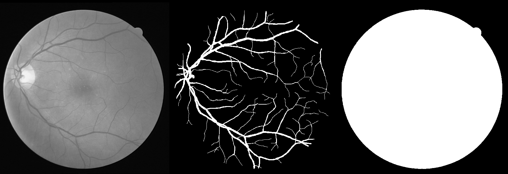
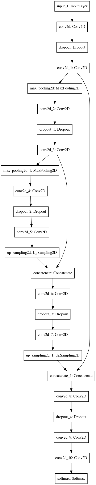

# retina-unet
该项目的实现参考了[orobix/retina-unet](https://github.com/orobix/retina-unet), 本人仅对其部分代码进行了重构. 重构的目的是使项目可以基于tensorflow2运行, 并且增加代码的可读性.

## 数据集

该项目的数据集有两个: DRIVE, CHASEDB, 以下是数据集的参数和样例.

参数\名称|DRIVE|CHASEDB
:-:|:--:|:-:
shape|(584, 565)|(960, 999)
train num|20|20
test num|20|8

下面是数据集的一个样本, 三幅图像从左到右依次是:

* 原始图像(数据集中为RGB图像, 为了展示, 此处转为了灰度图像).
* 标注图像, 白色(255)为血管标注, 黑色(0)为背景.
* 掩码图像, 用于区分眼球部分和非眼球部分.

DRIVE和CHASEDB两个数据集的下载地址如下:

* [DRIVE](https://pan.baidu.com/s/1M9k07LKul2c8gZBUzJ-TzA), 提取码: w2cf
* [CHAEDB](https://pan.baidu.com/s/1ZigFfnciLkQBd5AgMFWldg), 提取码: 6tac

## 数据集准备

在运行该项目之前, 首先需要准备数据集, 该过程如下:

1. 下载数据集.
2. 在项目的根目录下创建文件夹datasets.
3. 将下载所得的数据集解压到datasets中, 并根据文件夹结构修改配置文件config.txt中的数据集路径和合适的h5py文件存储路径.
4. 运行rewrite_datasets.py.

以上过程会读取数据集, 然后将数据按类别分别写入*.hdf5文件, 这样做是为了使之后读取数据更简单.

## 模型结构

该项目使用unet实现眼底血管分割目标, 但是所实现的模型是在原有的unet模型上修改得到的, 该模型只进行了两次下采样和上采样, 计划处理的输入图像是48*48的小样本. 下面是模型结构图:

## 训练数据生成器

原有的两个数据集都只有20张训练图片, 为了获得更好的训练效果, 需要对现有的训练样本进行重复提取. 重复提取时, 以一张图像的左上角为出发点, 每次提取一个48*48的小样本, 然后平移一定距离, 再次提取, 如此重复. 提取得到的小样本虽然存在重复区域, 但是因为在小样本中相对位置的不同, 还是能为训练提供有效信息.

## 训练过程

训练模型包含以下几个步骤: 

1. 修改配置文件config.txt中generator, train两部分.

   generator的sub_height, sub_width指明生成器输出小样本的尺寸(不建议修改这两个参数); stride_h, stride_w则指明生成器生成小样本时每次移动的距离. train的name是本次训练生成模型的名字, datasets用于选择使用训练数据集(DRIVE或者CHASEDB).

2. 运行训练脚本train.py.

   训练之后, 模型文件和权重文件将保存在./logs/目录之下.

## 测评

测试模型包含以下几个步骤:

1. 修改配置文件config.txt中generator, evaluate两部分.

   generator的stride_h, stride_w两个参数需要修改为16, 以保证分割结果能正确拼接. evaluate中的name指明测试模型的名字; best_last用于选择是调用训练时性能最好的模型还是最后输出的模型; datasets则用于选择测试数据集(DRIVE或CHASEDB).

2. 运行测评脚本evaluate.py.

   测试结果包括两部分: 一部分为可视化的分割结果, 输出到./logs/中; 另一部分为性能指标, mIOU, AP, mAP.

下面是输出结果示例. 可视化结果中, 亮色代表正确分割, 绿色代表漏分割, 红色代表错误分割.

