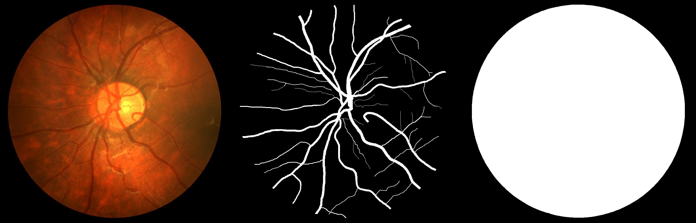
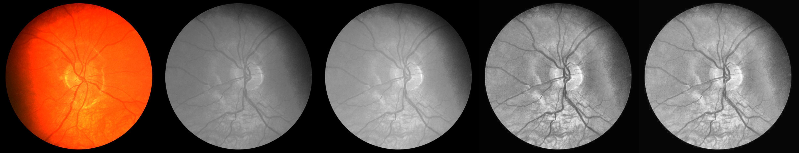
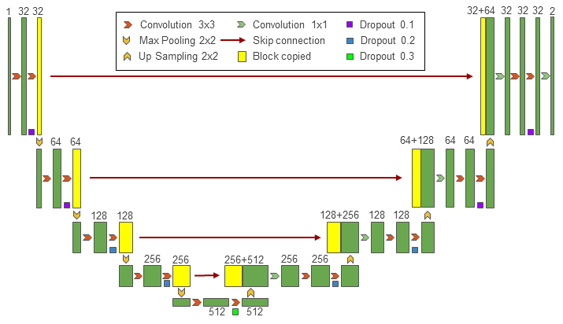
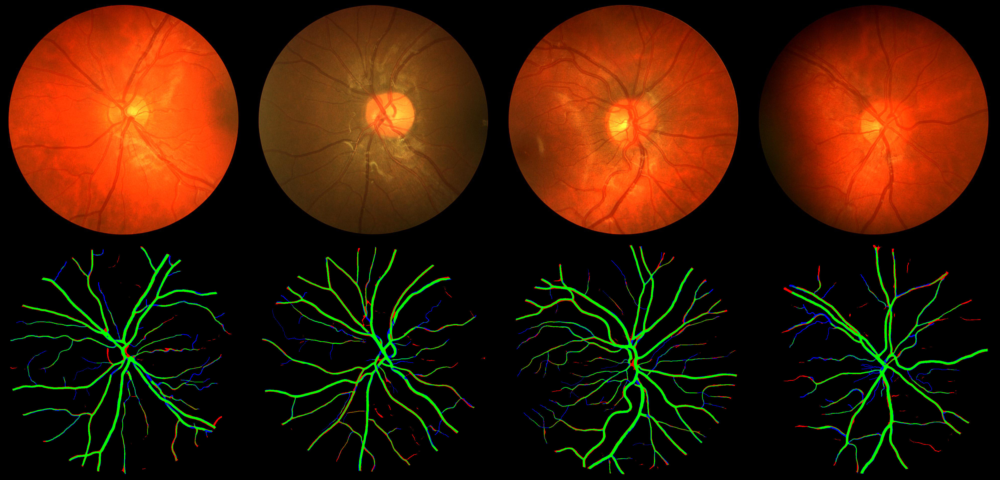

# retina-unet

该项目的实现参考了[orobix/retina-unet](https://github.com/orobix/retina-unet), 本人仅对其部分代码进行了重构. 重构的目的是使项目可以基于tensorflow2运行, 并且增加代码的可读性. 项目共完成了以下几部分的内容:

- [x] 视网膜图像预处理
- [x] U-Net网络模型(tf2)
- [x] 模型训练
- [x] 结果评估与可视化

## 0 运行环境(主要)

```
h5py >= 2.10.0
numpy >= 1.18.1
opencv-python >= 3.4.9.33
Pillow >= 7.1.2
pydot-ng >= 2.0.0
tensorflow-gpu >= 2.1.0
```
## 1 视网膜图像预处理

### 1.1 数据集

该项目的数据集有两个: DRIVE, CHASEDB. 数据集的具体参数与样例如下.

参数\名称|DRIVE|CHASEDB
:-:|:--:|:-:
shape|(584, 565)|(960, 999)
train num|20|20
test num|20|8



### 1.2 数据集准备与预处理

DRIVE和CHASEDB两个数据集的下载地址分别为:[DRIVE](https://pan.baidu.com/s/1M9k07LKul2c8gZBUzJ-TzA), w2cf; [CHAEDB](https://pan.baidu.com/s/1ZigFfnciLkQBd5AgMFWldg), 6tac. 数据集准备时, 首先从这两个网址下载数据集, 并将其分别解压到./datasets/路径下, 然后运行rewrite_datasets.py. 最终的结果如下所示, 其中h5py/路径下是重写的数据集(便于后续读取).

* 数据集结构\
datasets/\
├── CHASEDB\
│   ├── h5py\
│   ├── test\
│   └── training\
└── DRIVE\
    ├── h5py\
    ├── test\
    └── training

数据集的预处理过程包括4步: 1) 彩色图像转灰度图像; 2) 数据标准化; 3) 直方图均衡化; 4) 伽马变换. 下面是预处理过程的可视化结果, 可以发现, 两张视网膜图像经过处理后都得到了较好的结果.




## 2 U-Net网络模型(tf2)

该项目使用U-Net实现眼底血管分割目标, 但是所实现的模型是对原始U-Net模型微调后的结果, 结构图如下所示. 



## 3 模型训练

训练模型包含2个步骤: 

1. 修改配置文件config.txt中[train]部分的参数, 其中name用于命名本次实验, datasets用于指定本次实验所用的数据集.
2. 运行训练脚本train.py. 训练之后, 中间结果, 模型文件和权重文件都将保存在./logs/$name$/目录之下.

## 4 结果评估与可视化

与训练部分相同, 结果评估包含2个步骤:

1. 修改配置文件config.txt中[evaluate]部分, 保证实验名称与数据集是正确的.
2. 运行测评脚本evaluate.py. 测试结果包括两部分: 一部分为可视化的分割结果, 输出到./logs/$name$/predicts/路径下; 另一部分为性能指标, mIOU, AP, mAP.

下面是性能评估与可视化结果, 在可视化部分, 绿色代表正确分割, 红色代表错误分割, 蓝色代表漏分割. 

数据集\名称|mIOU|PA|mPA
:-:|:--:|:-:|:-:
DRIVE|0.818006|0.954971|0.879082|
CHASEDB|0.80988|0.961048|0.9027


