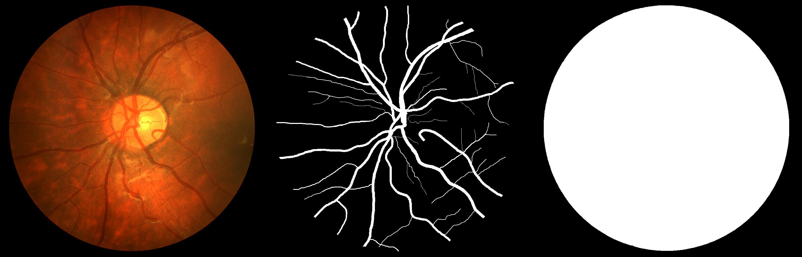
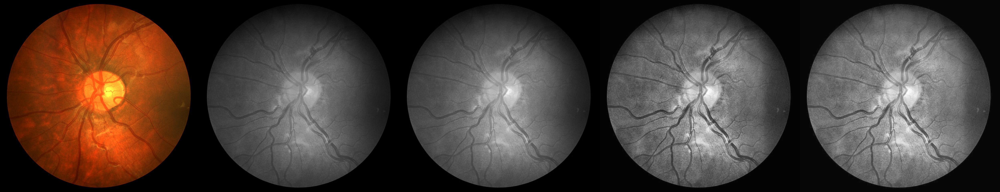
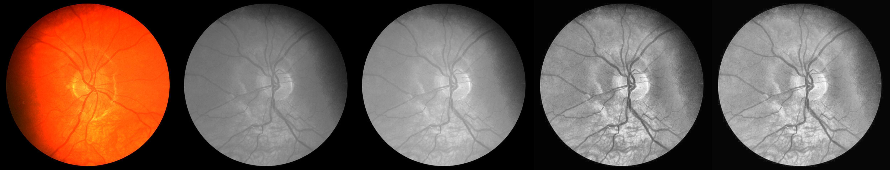
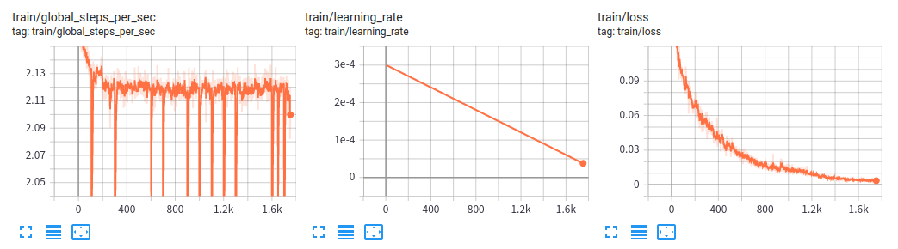
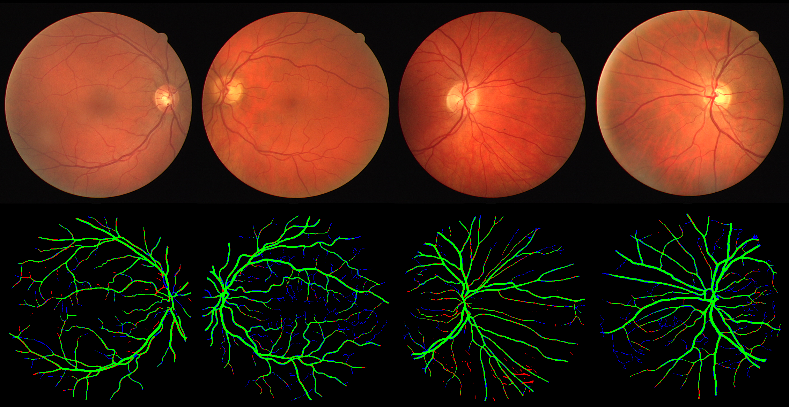
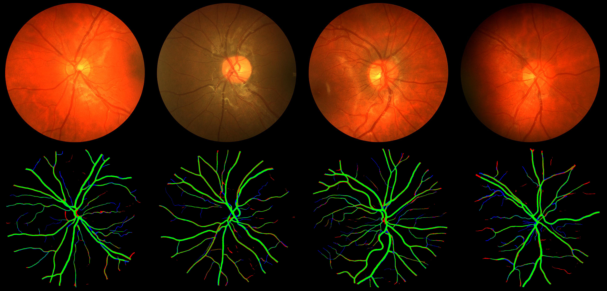

# retina-unet

该项目使用U-Net完成眼底血管分割任务, 主要包括以下内容:

- [x] 视网膜图像预处理(参考[orobix/retina-unet](https://github.com/orobix/retina-unet))
- [x] U-Net模型(tf2)
- [x] 数据pipeline(tf.data.Dataset)
- [x] 模型训练与训练过程可视化(distribute)
- [x] 模型评估与结果可视化

## 0 运行环境(主要)

```
absl-py >= 0.9.0
numpy >= 1.18.5
opencv-python >= 4.5.1.48
scikit-image >= 0.17.2
tensorflow-gpu >= 2.3.0
```
## 1 视网膜图像预处理

### 1.1 数据集

该项目的数据集有两个: DRIVE, CHASEDB. 数据集的具体参数与样例如下.

参数\名称|DRIVE|CHASEDB
:-:|:--:|:-:
shape|(584, 565)|(960, 999)
train num|20|20
test num|20|8



### 1.2 数据集准备与预处理

DRIVE和CHASEDB两个数据集的下载地址和提取码: [data](https://pan.baidu.com/s/19-a6wg__PeOK54crLfK0JA), 3vnk. 下载数据集并解压后, 运行preprocess.py进行预处理: 

```
python preprocess.py --data_dir {data_dir}
```

数据集的预处理过程包括4步: 1) 彩色图像转灰度图像; 2) 数据标准化; 3) 直方图均衡化; 4) 伽马变换. 预处理过程的可视化结果如下, 可以发现，预处理可以增强图像的对比度、细节纹理等方面. 而后续实验表明, 预处理可以显著提高分割性能.





## 2 U-Net模型(tf2)

论文链接: [U-Net: Convolutional Networks for Biomedical Image Segmentation](https://arxiv.org/abs/1505.04597)

相对论文中的网络结构, 项目中实现的模型进行了以下调整:

1. 通道数减少为原来的1/2.
2. 卷积层使用边界填充, 跳跃连接时不用crop.
3. 上采样可以选择使用转置卷积替代最近邻插值+1x1卷积.

## 3 模型训练与训练过程可视化

运行train.py训练模型: 

```
python train.py --logdir=log/retina \
	--label_file_path=data/CHASEDB/training.txt \
	--batch_size=4 \
	--max_iters=2000 \
	--preprocess=True \
	--transpose_conv=True \
```

```
python train_distribute.py --logdir=log/retina_distribute \
	--label_file_path=data/CHASEDB/training.txt \
	--batch_size=8 \
	--max_iters=1000 \
	--preprocess=True \
	--transpose_conv=True \
```

训练过程中的训练速度、学习率和模型损失可以通过tensorboard查看:

```
tensorboard --logdir {logdir}/train_logs
```



## 4 结果评估与可视化

运行evaluate.py评估模型并可视化分割结果:

```
python evaluate.py --logdir=log/retina \
	--label_file_path=data/CHASEDB/test.txt \
	--batch_size=1 \
	--preprocess=True \
	--transpose_conv=True \
	--visulize=True \

# outputs.
confuse mat:
 [[4678420   87758]
 [ 120699  360200]]
IoU:  0.6334222562986124
mIoU:  0.79538286
```

下面是可视化结果, 绿色代表正确分割, 红色代表错误分割, 蓝色代表漏分割.


